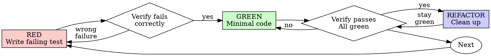

# テスト駆動開発（TDD）

## 概要

先にテストを書く。失敗を確認する。通すための最小コードを書く。

**中核原則:** テストの失敗を自分で見ていなければ、そのテストが正しい対象を検証している保証はない。

**ルールの文言違反は、ルール精神の違反。**

## 使うべき場面

**常に適用:**
- 新機能
- バグ修正
- リファクタリング
- 挙動変更

**例外（人間パートナーに確認）:**
- 使い捨てプロトタイプ
- 生成コード
- 設定ファイル

「今回だけ TDD を省略」は合理化。停止すること。

## 鉄則

```
NO PRODUCTION CODE WITHOUT A FAILING TEST FIRST
```

テスト前にコードを書いたら、削除してやり直す。

**例外なし:**
- 「参照として残す」は不可
- テスト作成中に流用して調整しない
- 見ない
- 削除は本当に削除

## Red-Green-Refactor



### RED - 失敗テストを書く

起こるべき挙動を示す最小テストを 1 つ書く。

**要件:**
- 1テスト1挙動
- 意味の明確な名前
- 可能な限り実コードを使う（不要な mock を避ける）

### Verify RED - 失敗を確認

**必須。省略禁止。**

```bash
npm test path/to/test.test.ts
```

確認事項:
- テストが「失敗」する（クラッシュではない）
- 失敗理由が期待どおり
- タイポでなく機能未実装が原因

通ってしまうなら、既存挙動を試している。テスト設計を修正する。

### GREEN - 最小実装を書く

テストを通す最小コードだけ実装する。

追加機能、別箇所改善、ついでリファクタは禁止。

### Verify GREEN - 成功を確認

**必須。**

```bash
npm test path/to/test.test.ts
```

確認事項:
- 対象テストが通る
- 他テストも通る
- 出力がクリーン（エラー/警告なし）

失敗したらコードを直す。テストを甘くしない。

### REFACTOR - 整理

GREEN 後のみ実施:
- 重複除去
- 命名改善
- ヘルパー抽出

挙動は変えない。常に green を維持。

### Repeat

次の挙動について再び failing test から開始。

## 良いテストの条件

| Quality | Good | Bad |
|---------|------|-----|
| Minimal | 一つのことだけ検証 | `and` で複数挙動を詰め込む |
| Clear | 挙動を名前で説明 | `test1` のような曖昧名 |
| Intent | 期待 API を示す | 実装詳細だけを検証 |

## なぜ順序が重要か

「後でテストを書く」では不十分:
- 実装後テストは最初から通りがちで検証力を証明できない
- 実装に引きずられ、要件でなく現実実装をテストしやすい
- 抜けた境界ケースを見逃しやすい

テスト先行は「何を作るべきか」を先に固定する。

## よくある合理化

| Excuse | Reality |
|--------|---------|
| "Too simple to test" | 単純コードでも壊れる。30秒でテスト可能 |
| "I'll test after" | 後追い成功は証明力が弱い |
| "Already manually tested" | 手動確認は再現性と記録に欠ける |
| "Deleting work is wasteful" | サンクコスト。未検証コード保持の方が高コスト |
| "Keep as reference" | 参照流用は実装先行の温床 |
| "Need to explore first" | 探索は捨て、正式実装は TDD でやり直す |
| "TDD slows me down" | 本番デバッグより速い |

## 危険信号（出たらやり直し）

- テスト前にコードを書いた
- 実装後にテストを足した
- テストが最初から通る
- なぜ失敗したか説明できない
- 「今回だけ」思考
- 「手動で全部試した」
- 「精神が大事で儀式でなくてよい」
- 「参照として残す」

**該当したら: コードを削除して TDD で再開始。**

## バグ修正例

**Bug:** 空メールが受理される

**RED**
```typescript
test('rejects empty email', async () => {
  const result = await submitForm({ email: '' });
  expect(result.error).toBe('Email required');
});
```

**Verify RED**
```bash
$ npm test
FAIL: expected 'Email required', got undefined
```

**GREEN**
```typescript
function submitForm(data: FormData) {
  if (!data.email?.trim()) {
    return { error: 'Email required' };
  }
  // ...
}
```

**Verify GREEN**
```bash
$ npm test
PASS
```

## 完了前チェックリスト

- [ ] 新規関数/メソッドごとにテストがある
- [ ] 実装前に各テストの失敗を確認した
- [ ] 失敗理由は想定どおり（機能未実装）だった
- [ ] 各テストを通す最小コードを書いた
- [ ] 全テストが通る
- [ ] 出力がクリーン
- [ ] テストは可能な限り実コード検証
- [ ] 境界ケース・エラーケースを網羅

1つでも未達なら TDD 不実施。やり直す。

## 行き詰まり時

| Problem | Solution |
|---------|----------|
| どうテストすべきか分からない | 望む API を先に書き、アサーションから始める。人間パートナーに相談 |
| テストが複雑すぎる | 設計が複雑。インターフェースを単純化 |
| mock だらけになる | 結合が強すぎる。DI で分離 |
| セットアップが巨大 | ヘルパー抽出。それでも重いなら設計簡素化 |

## デバッグ連携

バグを見つけたら、まず再現 failing test を書いて TDD サイクルで修正する。

テストなしのバグ修正は禁止。

## テスト反パターン

mock やテストユーティリティを追加する場合は `@testing-anti-patterns.md` を参照し、次を避ける:
- mock の挙動だけを検証
- 本番クラスにテスト専用メソッドを追加
- 依存理解なしの安易な mock

## 最終ルール

```
Production code → test exists and failed first
Otherwise → not TDD
```

人間パートナーの明示許可なしに例外はない。
