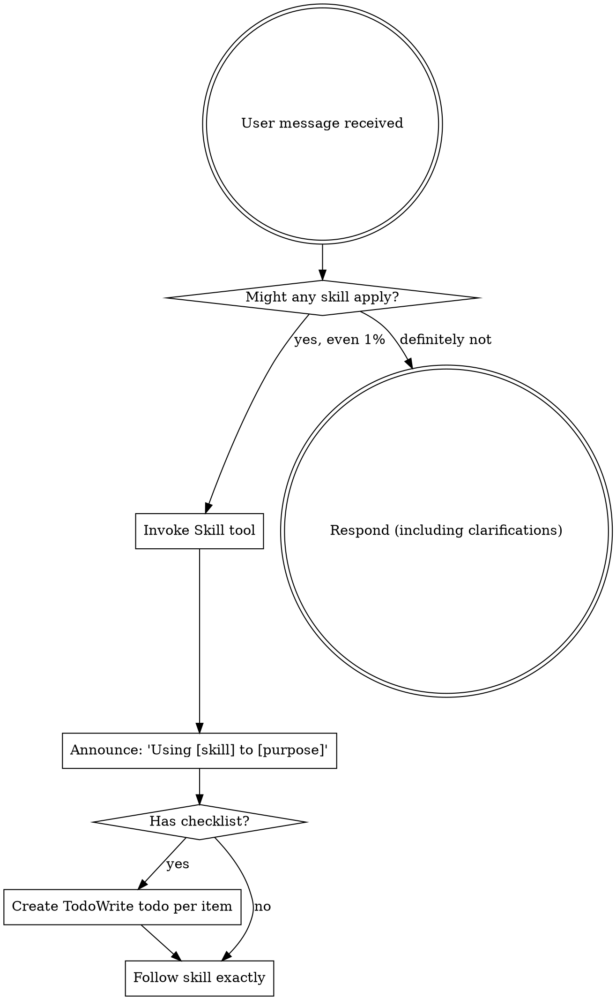

<EXTREMELY-IMPORTANT>
実施しようとしている作業にスキルが当てはまる可能性が 1% でもあるなら、必ずスキルを呼び出すこと。

タスクに適用可能なスキルがあるなら、選択の余地はない。必ず使うこと。

これは交渉不可。任意ではない。理屈をつけて回避してはならない。
</EXTREMELY-IMPORTANT>

## スキルへのアクセス方法

**Claude Code の場合:** `Skill` ツールを使う。スキルを呼び出すと内容が読み込まれて提示されるので、その指示に直接従う。スキルファイルに Read ツールは使わない。

**その他環境の場合:** スキル読み込み方法は各プラットフォームのドキュメントを確認する。

# スキルの使い方

## ルール

**関連または要求されたスキルは、あらゆる応答・行動より前に呼び出す。** 適用可能性が 1% でもあるなら、確認のために呼び出す。呼び出した結果「今回は不適」と分かった場合は、使わなくてよい。

## 危険信号

次の思考が出たら停止すること。合理化が始まっている。

| 思考 | 現実 |
|---------|---------|
| 「これは単純な質問だ」 | 質問もタスク。まずスキル確認。 |
| 「まず文脈を追加で集めたい」 | スキル確認は確認質問より先。 |
| 「まずコードベースを見てから」 | どう探索するかはスキルが定義する。先に確認。 |
| 「git/ファイルだけ先に軽く見よう」 | ファイルだけでは会話文脈が欠ける。先に確認。 |
| 「先に情報収集だけしておく」 | 収集方法もスキルが定義する。 |
| 「これは正式なスキル不要」 | スキルが存在するなら使う。 |
| 「このスキルは覚えている」 | スキルは更新される。現行版を読む。 |
| 「これはタスク扱いじゃない」 | 行動はタスク。まず確認。 |
| 「このスキルは大げさ」 | 単純な作業ほど複雑化しやすい。使う。 |
| 「この1つだけ先にやる」 | 何をするにも前に確認。 |
| 「これは生産的に感じる」 | 無秩序な行動は時間を浪費する。スキルが防ぐ。 |
| 「意味は分かっている」 | 概念理解 ≠ スキル適用。呼び出すこと。 |

## スキル優先順位

複数スキルが該当する場合は次の順番で使う:

1. **プロセス系スキルを先に**（brainstorming, debugging） - タスクへの向き合い方（HOW）を決める
2. **実装系スキルを次に**（frontend-design, mcp-builder） - 実行手順を導く

「X を作る」→ まず brainstorming、その後に実装系スキル。
「このバグを直す」→ まず debugging、その後にドメイン固有スキル。

## スキル種別

**厳格型**（TDD, debugging）: 厳密に従う。規律を自己流に崩さない。

**柔軟型**（patterns）: 原則を文脈に合わせて適用する。

どちらかは各スキル本文が示す。

## ユーザー指示

ユーザー指示は WHAT（何を）であり HOW（どうやって）ではない。`Add X` や `Fix Y` は、ワークフロー省略の許可ではない。
